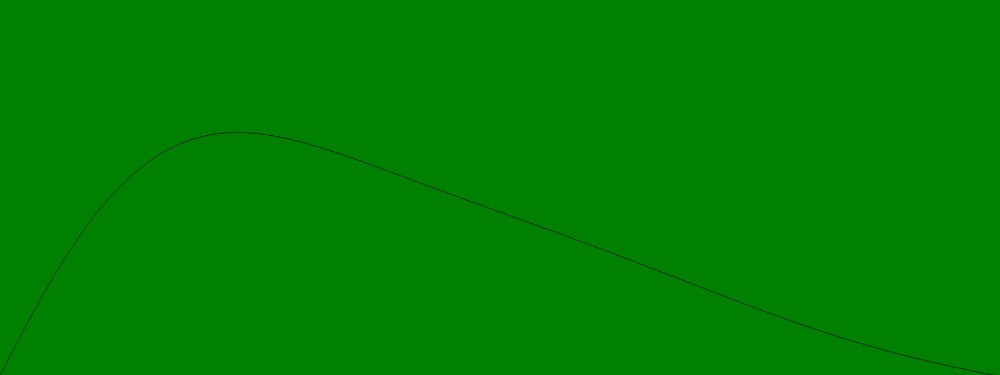

# beezy

this modules solves amplitude over time for bezier curves with any amount of control points.

It was designed for use creating audio envelopes. See [entry.js](entry.js) for an example that uses this module to both draw and play audio envelopes.  To see the example in action, simply serve up the public folder, and load the index.html in your browser.




## usage

Initiate the solver function with an array of control point coordinates:

```js
var solver = require('beezy')

//  the coordinates
var curves = [[0,0], [.05, 1], [.2, .25],[.75, .5],  [1,0]]

var solve = solver(curves)

for(var t = 0; t < 100; t++){
  var y = solve(t/100)
}

```

